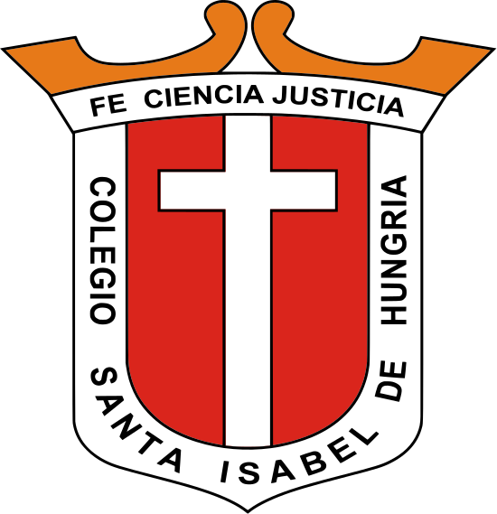

<h1 align="center">
  <br>
  
  <br>
  <b>Colegio Santa Isabel de Hungría</b>
  <br>
  <sub>Plataforma Web Oficial e Institucional</sub>
</h1>

<p align="center">
  <b>Un proyecto educativo web moderno, interactivo e inmersivo diseñado para la excelencia académica y formativa salesiana.</b>
</p>

<p align="center">
  <a href="#-desarrollador">👨‍💻 Desarrollador</a> •
  <a href="#-tecnologías">⚡ Tecnologías</a> •
  <a href="#-características">✨ Características</a> •
  <a href="#-oferta-académica">🎓 Oferta Académica</a> •
  <a href="#-instalación">🚀 Instalación</a> •
  <a href="#-licencia">📄 Licencia</a>
</p>

---

## 👨‍💻 Desarrollador

> [!IMPORTANT]
> **Desarrollo Integral**: Todo este proyecto web ha sido concebido, diseñado y **desarrollado en su totalidad por Santiago Arias**.

---

## 🏫 Sobre el Proyecto

La plataforma web del **Colegio Santa Isabel de Hungría (COLSIH)** es una solución digital de última generación construida para reflejar la identidad, la excelencia académica y el carisma salesiano de la institución ubicada en Floridablanca, Santander, Colombia.

Proporciona una experiencia de usuario (UX/UI) fluida, ultra-rápida y adaptable (responsive), facilitando el acceso a la oferta educativa, admisiones, historia, valores institucionales y canal directo con la Plataforma Integra.

---

## ⚡ Tecnologías Utilizadas

| Categoría | Tecnología | Descripción |
| :--- | :--- | :--- |
| **Backend** |  | Framework robusto PHP en su versión 11 |
| **Frontend** |  | Biblioteca de interfaz de usuario reactiva |
| **Monolito Moderno** |  | Puente dinámico entre Laravel y React sin APIs intermedias |
| **Estilos** |  | Framework CSS utilitario para diseño responsivo |
| **Animaciones** | **Framer Motion & Tailwind** | Animaciones fluidas, transiciones de página y micro-interacciones |
| **Empaquetador** |  | Compilación ultrarrápida de componentes |
| **Tour 360°** | **Pannellum JS** | Visor panorámico e interactivo de los espacios académicos |

---

## ✨ Características Principales

* 🎨 **Diseño Institucional Premium**: Paleta cromática cuidada con Azul Real (`#003C8F`), Vinotinto Salesiano (`#800A15`) y Blanco puro.
* 📱 **Totalmente Responsivo**: Optimizado para dispositivos móviles, tablets y monitores de escritorio de alta resolución.
* 🏛️ **Sección "Nuestro Colegio"**:
  * **Quiénes Somos**: Presentación institucional con máscara visual 3D.
  * **Historia**: Línea de tiempo interactiva por hitos y fotografías históricas desde 1980.
  * **Misión y Visión**: Declaración de principios pedagógicos salesianos.
  * **Valores**: Tarjetas interactivas con las dimensiones espiritual, social, humana y pedagógica.
  * **Equipo**: Equipo directivo y docente salesiano.
* 🕊️ **Movimiento Juvenil Salesiano (MJS)**: Espacio dedicado a la pastoral juvenil con diseño de marca independiente y botón flotante de navegación.
* 🟢 **Integración WhatsApp Flotante**: Botón accesible en la esquina inferior derecha para atención directa a padres de familia.
* 🎓 **Acceso a Plataforma Integra**: Enlace directo en el encabezado hacia la plataforma académica escolar (`https://e.plataformaintegra.net/sihungria/`).

---

## 🎓 Oferta Académica

Cada oferta formativa cuenta con su propia pestaña individual, diseño exclusivo y esquema de color acorde a la etapa evolutiva de los estudiantes:

| Nivel | Ruta | Tema Visual | Enfoque Principal |
| :--- | :--- | :--- | :--- |
| **Preescolar** | `/oferta-academica/preescolar` | 🟠 Ámbar / Naranja Cálido | Estimulación temprana, pedagogía del amor y adaptación feliz |
| **Básica Primaria** | `/oferta-academica/primaria` | 🟢 Verde Esmeralda / Menta | Pensamiento lógico, lectoescritura e inglés intensivo |
| **Bachillerato** | `/oferta-academica/bachillerato` | 🔵 Azul Real & Vinotinto | Rigor científico, Pre-ICFES, laboratorios y ciudadanía |
| **Articulación SENA** | `/oferta-academica/sena` | 🟧 Naranja SENA / Slate | Doble titulación técnico-profesional en Contabilidad y Sistemas |

---

## 🚀 Instalación y Configuración Local

Sigue estos pasos para clonar y ejecutar el proyecto en tu entorno local de desarrollo:

### 📋 Requisitos Previos
* PHP >= 8.2
* Composer >= 2.5
* Node.js >= 18.0 & npm
* Servidor MySQL o PostgreSQL

### 🔧 Pasos de Ejecución

1. **Clonar el repositorio**:
   ```bash
   git clone https://github.com/Steven08Ar/COLSIH-Web.git
   cd COLSIH-Web/web
   ```

2. **Instalar dependencias de PHP y JavaScript**:
   ```bash
   composer install
   npm install
   ```

3. **Configurar el archivo de entorno**:
   ```bash
   cp .env.example .env
   php artisan key:generate
   ```

4. **Ejecutar migraciones (si aplica)**:
   ```bash
   php artisan migrate
   ```

5. **Iniciar el servidor de desarrollo**:
   ```bash
   # En una terminal para el backend Laravel:
   php artisan serve

   # En otra terminal para los componentes Frontend (Vite):
   npm run dev
   ```

6. **Compilación para Producción**:
   ```bash
   npm run build
   ```

---

## 📄 Licencia

Este proyecto está bajo la protección y propiedad institucional del **Colegio Santa Isabel de Hungría**.

---

<p align="center">
  <sub>Desarrollado con ❤️ por <b>Santiago Arias</b> para la comunidad educativa del <b>COLSIH</b>.</sub>
</p>
